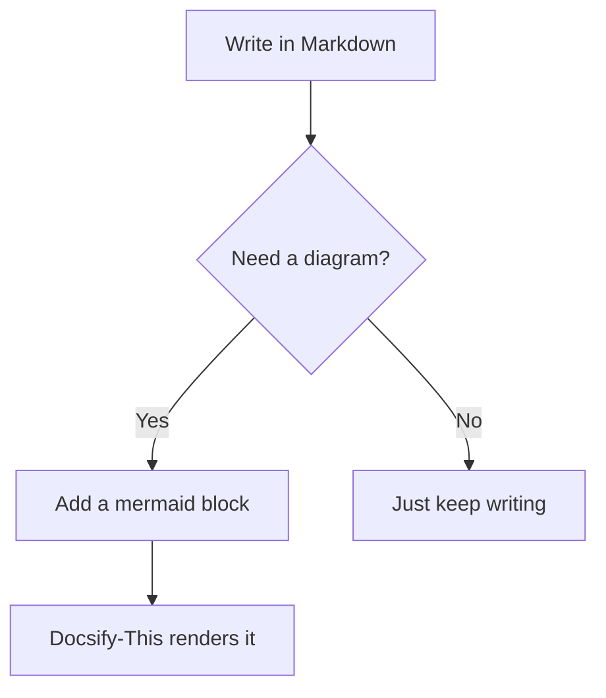

# LaTeX and Mermaid

Beyond text formatting, Markdown can also render math notation and diagrams &ndash; handy for course notes in math, science, or computer science.

## LaTeX Math

Wrap inline math in single dollar signs:

```markdown
The quadratic formula is $x = \frac{-b \pm \sqrt{b^2 - 4ac}}{2a}$.
```

Renders to: The quadratic formula is $x = \frac{-b \pm \sqrt{b^2 - 4ac}}{2a}$.

For a standalone equation on its own line, use double dollar signs:

```markdown
$$
E = mc^2
$$
```

Renders to:

$$
E = mc^2
$$

## Mermaid Diagrams

Use triple backticks with `mermaid` as the language name to render a diagram instead of a plain code block:

<pre>

</pre>

Renders to:


---

Next: [Practice Exercise](08-practice-exercise.md)
